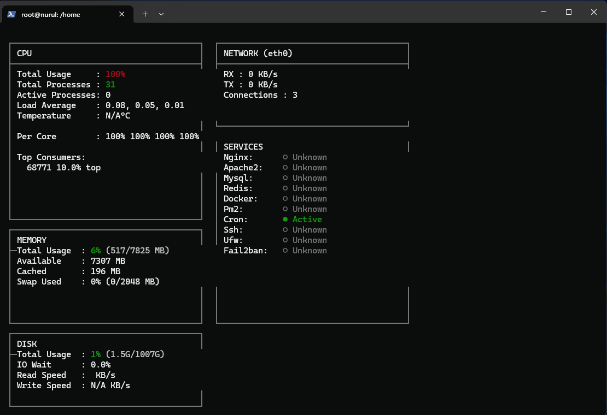
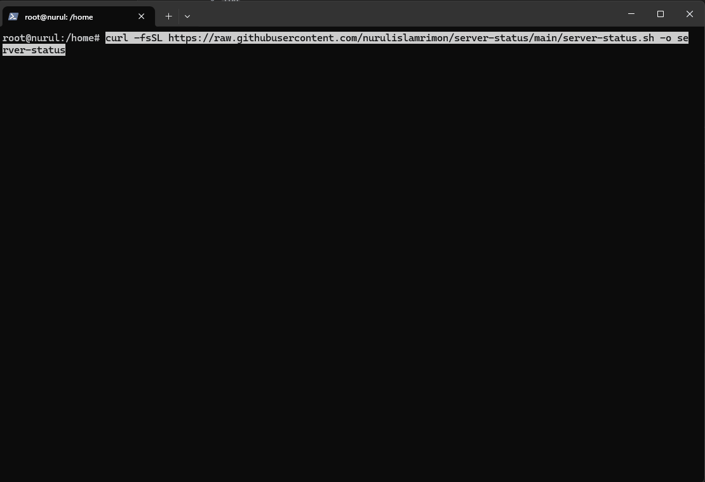

# Server Status – Grafana-style Terminal Dashboard



A beautiful, flicker-free, real-time terminal dashboard inspired by **Grafana Dark Theme**.  
Designed for production servers — fast, clean, and professional.

Monitors:

- CPU usage (total + per core)
- Memory & swap
- Disk usage
- Network RX/TX speed
- Active connections
- Total & active processes
- Top CPU-consuming processes
- Service status monitoring

---

## Requirements

- Linux (Ubuntu / Debian / CentOS / RHEL / Fedora)
- Bash **4+**
- Common tools:
  - `top`
  - `free`
  - `df`
  - `ps`
  - `awk`
  - `grep`
  - `ss`
- Optional:
  - `iostat` (for disk I/O)

---

## Installation (Using curl — No git)

### Download

```bash
curl -fsSL https://raw.githubusercontent.com/nurulislamrimon/server-status/main/server-status.sh -o server-status
```

### Make executable

```bash
chmod +x server-status
```

### Move to system path

```bash
sudo mv server-status /usr/local/bin/server-status
sudo chmod +x /usr/local/bin/server-status
```

### Run

```bash
server-status
```

---

## Visual



## Usage

```bash
server-status [OPTIONS]
```

### Options

| Option                   | Description                |
| ------------------------ | -------------------------- |
| `--help`                 | Show help                  |
| `--interface <name>`     | Override network interface |
| `--refresh <seconds>`    | Refresh interval           |
| `--services "svc1,svc2"` | Custom services list       |

---

## Example Output

```
CPU: 68.4% | Processes: 285 | Active: 12
Network RX: 245 KB/s | TX: 120 KB/s
Services: nginx mysql docker
```

---

## Customization

Edit variables at the top of the script to change:

- Refresh speed
- Services
- Colors
- Thresholds
- Layout

---

## License

MIT License

---

## Author

Nurul Islam Rimon  
https://github.com/nurulislamrimon

⭐ Star the repo if you like it!
